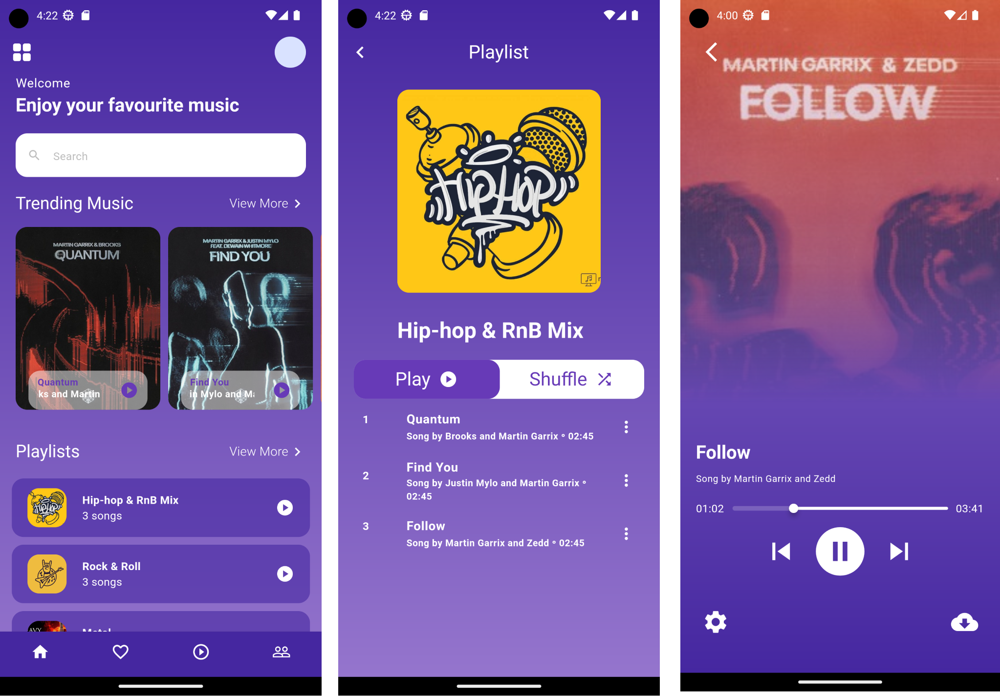

# Music App
A music demo app built with Flutter, Riverpod state management, and Material 3.

Fully open-source, No tracking of users, just good vibes and music.



## Todo
- [x] Home: Setup
- [x] Player interface
- [ ] Bottom navbar mods
- [ ] Move Player state to provider
- [ ] Trending page real-time updates for latest music (Spotify/Soundhound/YouTube API maybe?)
- [ ] Visualization effects
- [ ] EQ
- [ ] Theming - Change backgrounds as per the album art
- [ ] Create & save playlists
- [ ] Scan local files/folders for music
- [ ] Fetch album art online
- [ ] Fetch music lyrics in realtime
- [ ] Share song via socials (Only file/title/artist info to avoid piracy)
- [ ] Settings: crossfade options + (start & end) of crossfades
- [ ] Settings: Different themes
- [ ] Settings: Sign in/up for playlist cloud sync (playlists, favourites)
- [ ] Cloud sync and listen with friend in real-time (e.g. for karaoke purposes) 

### Live Checklist
- update version in pubspec.yaml
- utils > contants.dart
    - set appversion
    - enable bugsnag
    - set testing to false
- features > fbads > data > fb_ads_constants
    - set testing to false
- features > admob > data > admob_ads_constants
    - set testing to false

```bash
flutter build appbundle
```
[project]/build/app/outputs/bundle/release/app.aab.

> NB: [How To Deploy to Production](https://flutter.dev/docs/deployment/android). 

### Running app in dev
Run on the physical device. It is basically the release mode with some debug mode
```bash
flutter run --profile
```
- Use debug mode during development, when you want to use hot reload.
- Use profile mode when you want to analyze performance.
- Use release mode when you are ready to release your app.

## Dev

### Renaming package
update the `package_rename_config.yml` file

```bash
flutter pub run package_rename:set
```

#### Launcher Icons
```bash
flutter pub run flutter_launcher_icons:main
```

#### Updating Splash Image
Using the `flutter_native_splash` package

```bash
flutter pub run flutter_native_splash:create
```

### Signing App
Run command below to generate it in local folder 
```bash
keytool -genkey -v -keystore ./_files/upload-keystore.jks -keyalg RSA -keysize 2048 -validity 10000 -alias upload
```

### Android platform tools
- [Download from here](https://developer.android.com/studio/releases/platform-tools) and place in a directory
- Add the platform-tools to `PATH`. > Environment variables > user variables -> path

Connect android device
```bash
adb paid 192.168.100.20:12345
adb connect 192.168.100.20:12345
```
## Contribution
- Feel free to PR as we make this project a reality
- [Email us at info@acelords.com](mailto:info@acelords.com) for any enquiries
- Support development via [Ko-fi](https://ko-fi.com/acelords)

## AOB
Any music and art provided here belong to their respective copyright holders. They are only to be used for demo purposes in the early stages of development (and thereafter shall be removed). Please don't distribute them without checking their individual distribution rights.


